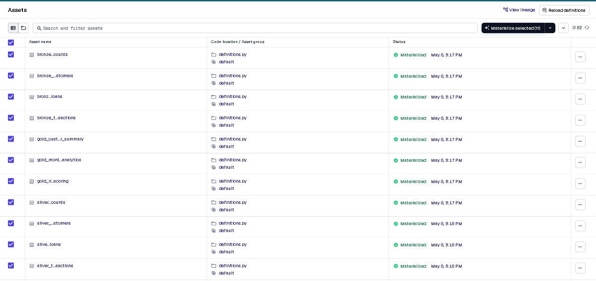

# Rising Ahead Data Engineering Assignment

## Tech Stack
- Python
- Dagster
- PostgreSQL
- Docker
- Pandas
- SQLAlchemy

## Configuration Handling

The project is designed to support multiple client deployments using configurable environment-based settings.

Configuration can be managed through:
- .env files for database credentials and secrets
- YAML configuration files for pipeline schedules and active datasets
- Environment variables for deployment-specific values

This avoids hardcoded credentials and makes the platform reusable across different client environments with minimal code changes.

## Project Structure

connectors/
pipeline/
data/
screenshots/

## How to Run

### Start PostgreSQL
docker compose up -d

### Install dependencies
pip install -r requirements.txt

### Run Dagster
py -m dagster dev -f pipeline/definitions.py

## Layers

### Bronze
Raw ingestion from CSV files.

### Silver
Cleaned and transformed datasets.

### Gold
- Customer summary analytics dataset
- Monthly analytics dataset
- Risk scoring dataset

## Features
- Dagster asset orchestration
- Bronze / Silver / Gold layered architecture
- PostgreSQL integration
- Dockerized local environment
- Incremental loading using row hash
- Dagster schedules and sensors
- Asset checks for data quality
- Logging and monitoring
- YAML-driven configuration support
- GitHub Actions CI/CD pipeline
- Automated pytest execution

## Screenshots
See screenshots folder.

# Architecture
The pipeline follows a layered Bronze → Silver → Gold architecture using Dagster for orchestration and PostgreSQL for storage.

# Data Flow
CSV Files → Bronze Layer → Silver Transformations → Gold Analytics Tables

# Incremental Loading Strategy
Silver transactions use row-level hashing to detect new or changed records before appending data into PostgreSQL tables.

# Dagster Orchestration
Dagster assets, schedules, sensors, and asset checks are used to orchestrate and monitor the pipeline.

# Asset Checks
Asset checks validate customer data quality by verifying null conditions on important columns.

# CI/CD Pipeline
GitHub Actions automatically installs dependencies and runs pytest validations on every push to the main branch.

# Configuration Management
Environment variables, .env files, and YAML configuration support deployment flexibility across environments.

## Future Improvements
- Add cloud deployment support (AWS/GCP/Azure)
- Add dbt transformation layer
- Add real-time streaming ingestion
- Add advanced data quality monitoring
- Add alerting integrations (Slack/Email)
- Improve partitioned incremental processing

## Dagster Assets

